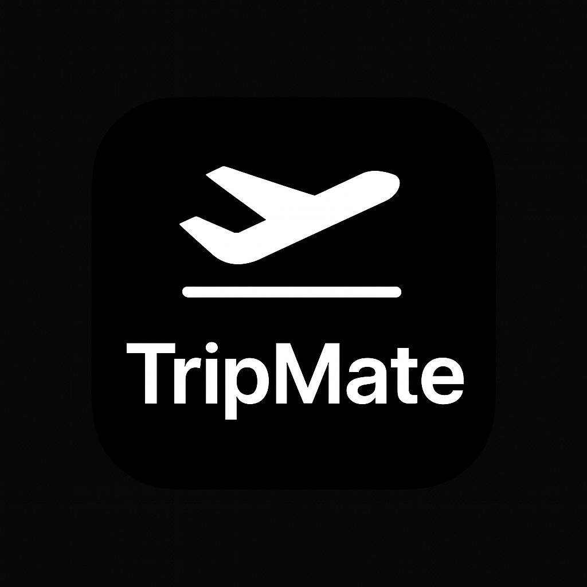
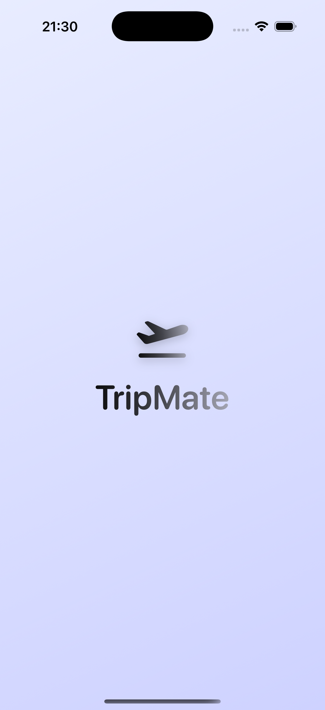
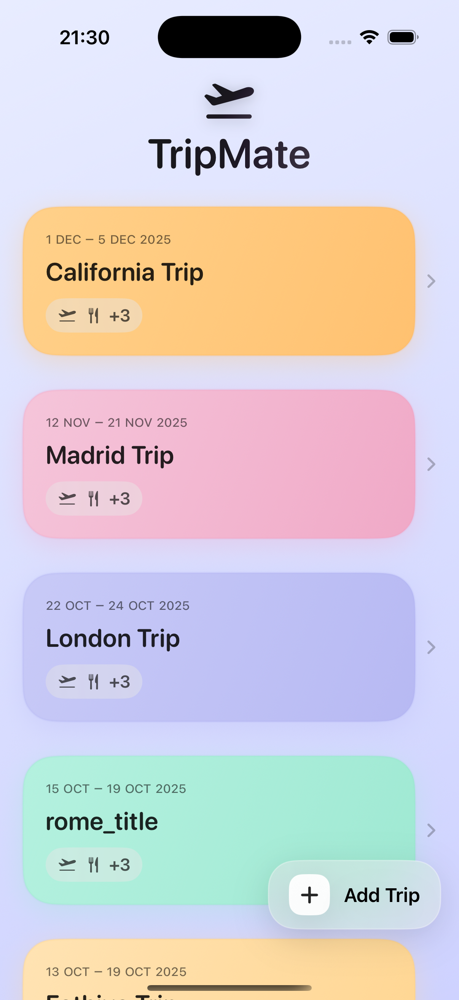
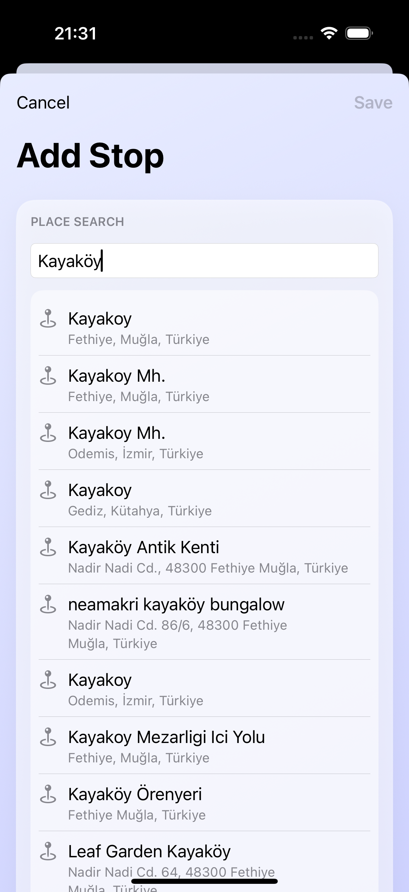
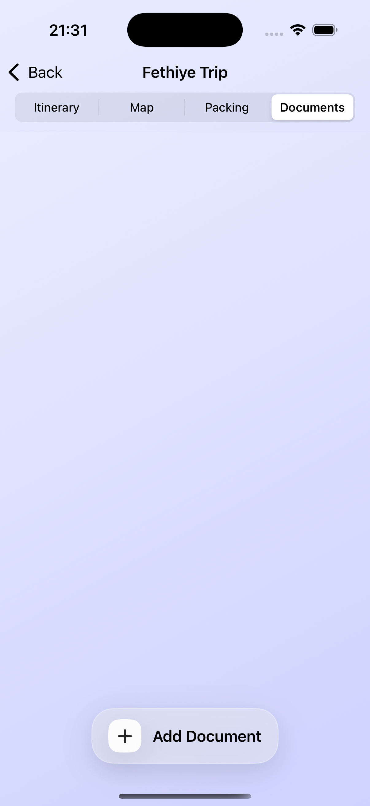
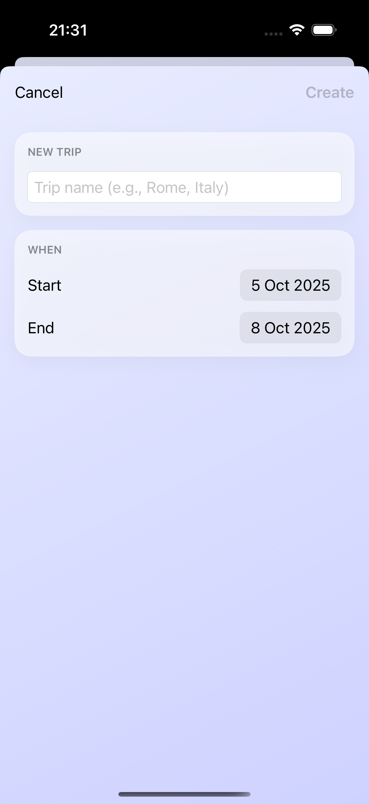
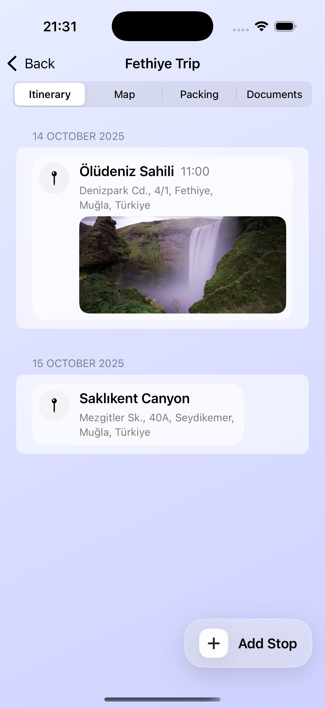
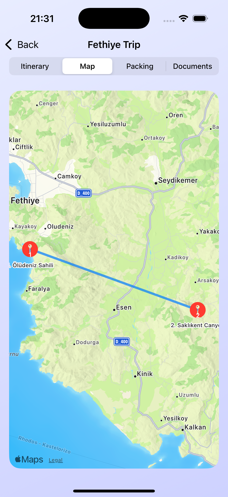
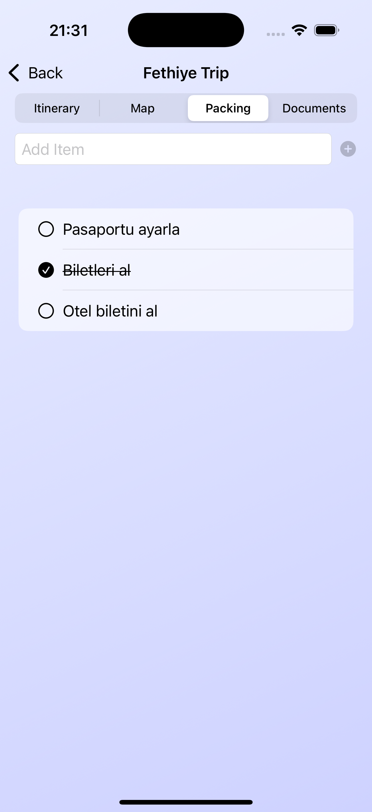

# ✈️ TripMate

TripMate is a modern and elegant **iOS travel planner app** built with **SwiftUI** and **SwiftData**.  
It helps you organize every part of your trip — **itinerary, map, packing list, and travel documents** — all in one smooth experience.

  

---

## 🌍 About the App

Plan your journeys with ease.  
TripMate allows you to:
- Create and manage trips with beautiful gradient cards
- Add itinerary stops with photos, maps, and links
- Organize packing checklists
- Save and view travel documents
- View all your destinations on a dynamic map
- Enjoy smooth animations and a clean, modern design

---

## 🧠 Technical Details

| Feature | Technology |
|----------|-------------|
| UI Framework | SwiftUI |
| Data Persistence | SwiftData |
| Maps & Location | MapKit |
| Architecture | MVVM (Clean Swift-inspired) |
| Localization | English & Turkish(soon) |
| Animations | Custom SwiftUI transitions |
| Design | Gradient-based color system & SF Symbols |
| Font | Poppins SemiBold (custom imported) |

## 📸 Screenshots

Below are some snapshots from the TripMate app, showcasing its elegant design and core features:

  
  
  
  
  
  
  
  

## 🎞️ App in Action

  

## 👨‍💻 Author

**Batuhan Küçükaydın**  
Software Engineer | Computer Engineer | iOS Developer  
📫 [LinkedIn](https://linkedin.com/in/batuhankucukaydin) • [GitHub](https://github.com/batukucukaydin) • [Medium](https://medium.com/@batuhankucukaydin)

## ⭐️ Support

If you like this project, please consider giving it a star 🌟  
It really helps me keep building and improving!

## 📄 License
This project is released under the MIT License.
